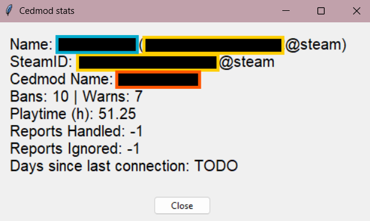

# Cedmod Stats

>[!Note]
> This project is still in active development 

A project to display moderation staff statistics for SCP:SL servers using the Cedmod API

| Statistic                  | Status         |
|----------------------------|----------------|
| Bans Issued                | Working        |
| Warns Issued               | Working        |
| Playtime                   | Working        |
| Reports Handled            | In development |
| Reports Ignored            | In development |
| Time since last connection | In development |

---

>This project makes use of the Cedmod API however it is not in endorsed by any of the Cedmod team
