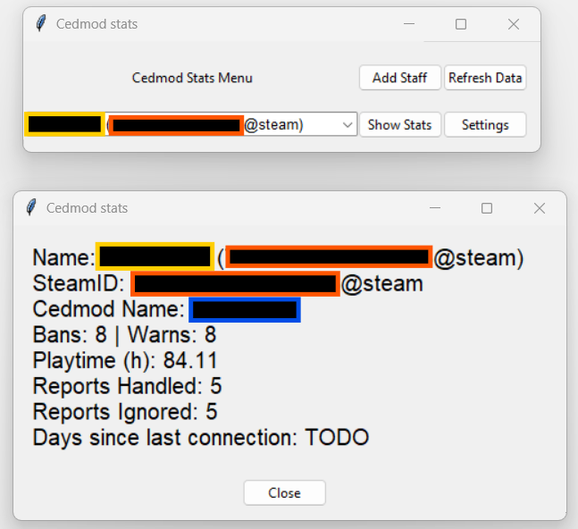

# Cedmod Stats

>[!IMPORTANT]
> This project is still in active development and is not recommended for use outside an IDE

A project to display moderation staff statistics for SCP:SL servers using the Cedmod API

| Statistic                  | Status          |
|----------------------------|-----------------|
| Bans Issued                | Working         |
| Warns Issued               | Working         |
| Playtime                   | Working         |
| Reports Handled            | Partly working* |
| Reports Ignored            | Partly working* |
| Time since last connection | Working         |\

 * Cedmod usernames are generally the same a discord names, however this is not always the case... 

When a discord username is updated the cedmod username remains the same and vise versa. This is only an issue for report stats as cedmod records the discord username as the report handler. In these cases an error message is displayed in the console and the stat is not collected. 
  This is planned to be fixed by adding another combobox to the "add staff" popup to allow users to select a discord username in the event that the cedmod name is diffrent.

| Feature                                                                                                                                                                       | Status   |
|-------------------------------------------------------------------------------------------------------------------------------------------------------------------------------|----------|
| Read and write list of Staff objects to file, rather than having to create a new one each time.                                                                               | Planned  |
| Read and write API key to file                                                                                                                                                | Planned  |
| -- Pre-Alpha 1 Release --                                                                                                                                                     | ---      |
| In the add staff popup add a comboBox to select discord name from the `Api/Stafflist/Query` endpoint in the event that the cedmod username and discord username are diffrent. | Planned  |
| Add popup to "Refresh Data" button to allow user to select page and max values to send to API.                                                                                | Planned  |
| In the refresh data popup, add an option for users to select a date in the past rather than max and page.                                                                     | Planned  | 
| Add a button to edit selected Staff object values                                                                                                                             | Planned  | 

---
>[!Note]
>This project makes use of data from the Cedmod API however it is **not** made by or endorsed by any of the Cedmod team
